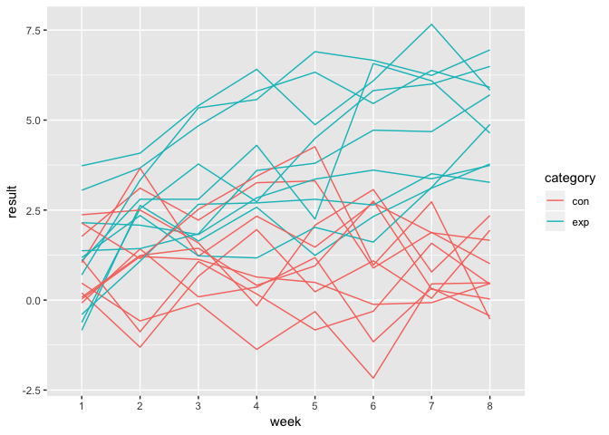
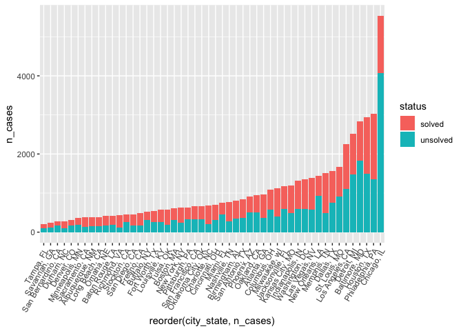
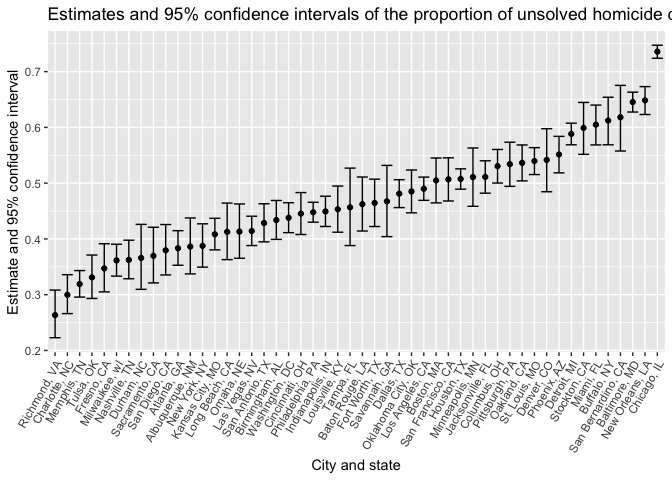

P8105\_hw5\_lz2586
================
Lyuou Zhang
11/4/2018

### Problem 1

Start with a function that reads data from the folder and cleans the
data. Including tidying, renaming variable names and changing variable
types.

``` r
# function for reading each 
read_data <- function(data_name){
  dta_address <- str_c('./data/', data_name)
  dta <- read_csv(dta_address) %>% 
    mutate(id = data_name) %>% 
    gather(key = week, value = result, week_1:week_8) %>% 
    mutate(week = str_replace(week, 'week_', ''),
           id = str_replace(id, '.csv', ''),
           category = ifelse(str_detect(id, 'con') == TRUE, 'con', 'exp'),
           id = str_sub(id, start = 5L),
           id = as.numeric(id)) %>% 
    select(category, id, everything())
}
```

Put file names in a list with `list.files` and use map to iterate for
all participants.

``` r
# read file names in a list
l <- list.files('./data') 

# Use map to iterate
df <- map_df(l, read_data)
```

    ## Parsed with column specification:
    ## cols(
    ##   week_1 = col_double(),
    ##   week_2 = col_double(),
    ##   week_3 = col_double(),
    ##   week_4 = col_double(),
    ##   week_5 = col_double(),
    ##   week_6 = col_double(),
    ##   week_7 = col_double(),
    ##   week_8 = col_double()
    ## )
    ## Parsed with column specification:
    ## cols(
    ##   week_1 = col_double(),
    ##   week_2 = col_double(),
    ##   week_3 = col_double(),
    ##   week_4 = col_double(),
    ##   week_5 = col_double(),
    ##   week_6 = col_double(),
    ##   week_7 = col_double(),
    ##   week_8 = col_double()
    ## )
    ## Parsed with column specification:
    ## cols(
    ##   week_1 = col_double(),
    ##   week_2 = col_double(),
    ##   week_3 = col_double(),
    ##   week_4 = col_double(),
    ##   week_5 = col_double(),
    ##   week_6 = col_double(),
    ##   week_7 = col_double(),
    ##   week_8 = col_double()
    ## )
    ## Parsed with column specification:
    ## cols(
    ##   week_1 = col_double(),
    ##   week_2 = col_double(),
    ##   week_3 = col_double(),
    ##   week_4 = col_double(),
    ##   week_5 = col_double(),
    ##   week_6 = col_double(),
    ##   week_7 = col_double(),
    ##   week_8 = col_double()
    ## )
    ## Parsed with column specification:
    ## cols(
    ##   week_1 = col_double(),
    ##   week_2 = col_double(),
    ##   week_3 = col_double(),
    ##   week_4 = col_double(),
    ##   week_5 = col_double(),
    ##   week_6 = col_double(),
    ##   week_7 = col_double(),
    ##   week_8 = col_double()
    ## )
    ## Parsed with column specification:
    ## cols(
    ##   week_1 = col_double(),
    ##   week_2 = col_double(),
    ##   week_3 = col_double(),
    ##   week_4 = col_double(),
    ##   week_5 = col_double(),
    ##   week_6 = col_double(),
    ##   week_7 = col_double(),
    ##   week_8 = col_double()
    ## )
    ## Parsed with column specification:
    ## cols(
    ##   week_1 = col_double(),
    ##   week_2 = col_double(),
    ##   week_3 = col_double(),
    ##   week_4 = col_double(),
    ##   week_5 = col_double(),
    ##   week_6 = col_double(),
    ##   week_7 = col_double(),
    ##   week_8 = col_double()
    ## )
    ## Parsed with column specification:
    ## cols(
    ##   week_1 = col_double(),
    ##   week_2 = col_double(),
    ##   week_3 = col_double(),
    ##   week_4 = col_double(),
    ##   week_5 = col_double(),
    ##   week_6 = col_double(),
    ##   week_7 = col_double(),
    ##   week_8 = col_double()
    ## )
    ## Parsed with column specification:
    ## cols(
    ##   week_1 = col_double(),
    ##   week_2 = col_double(),
    ##   week_3 = col_double(),
    ##   week_4 = col_double(),
    ##   week_5 = col_double(),
    ##   week_6 = col_double(),
    ##   week_7 = col_double(),
    ##   week_8 = col_double()
    ## )
    ## Parsed with column specification:
    ## cols(
    ##   week_1 = col_double(),
    ##   week_2 = col_double(),
    ##   week_3 = col_double(),
    ##   week_4 = col_double(),
    ##   week_5 = col_double(),
    ##   week_6 = col_double(),
    ##   week_7 = col_double(),
    ##   week_8 = col_double()
    ## )
    ## Parsed with column specification:
    ## cols(
    ##   week_1 = col_double(),
    ##   week_2 = col_double(),
    ##   week_3 = col_double(),
    ##   week_4 = col_double(),
    ##   week_5 = col_double(),
    ##   week_6 = col_double(),
    ##   week_7 = col_double(),
    ##   week_8 = col_double()
    ## )
    ## Parsed with column specification:
    ## cols(
    ##   week_1 = col_double(),
    ##   week_2 = col_double(),
    ##   week_3 = col_double(),
    ##   week_4 = col_double(),
    ##   week_5 = col_double(),
    ##   week_6 = col_double(),
    ##   week_7 = col_double(),
    ##   week_8 = col_double()
    ## )
    ## Parsed with column specification:
    ## cols(
    ##   week_1 = col_double(),
    ##   week_2 = col_double(),
    ##   week_3 = col_double(),
    ##   week_4 = col_double(),
    ##   week_5 = col_double(),
    ##   week_6 = col_double(),
    ##   week_7 = col_double(),
    ##   week_8 = col_double()
    ## )

    ## Parsed with column specification:
    ## cols(
    ##   week_1 = col_double(),
    ##   week_2 = col_double(),
    ##   week_3 = col_double(),
    ##   week_4 = col_double(),
    ##   week_5 = col_double(),
    ##   week_6 = col_double(),
    ##   week_7 = col_integer(),
    ##   week_8 = col_double()
    ## )

    ## Parsed with column specification:
    ## cols(
    ##   week_1 = col_double(),
    ##   week_2 = col_double(),
    ##   week_3 = col_double(),
    ##   week_4 = col_double(),
    ##   week_5 = col_double(),
    ##   week_6 = col_double(),
    ##   week_7 = col_double(),
    ##   week_8 = col_double()
    ## )
    ## Parsed with column specification:
    ## cols(
    ##   week_1 = col_double(),
    ##   week_2 = col_double(),
    ##   week_3 = col_double(),
    ##   week_4 = col_double(),
    ##   week_5 = col_double(),
    ##   week_6 = col_double(),
    ##   week_7 = col_double(),
    ##   week_8 = col_double()
    ## )
    ## Parsed with column specification:
    ## cols(
    ##   week_1 = col_double(),
    ##   week_2 = col_double(),
    ##   week_3 = col_double(),
    ##   week_4 = col_double(),
    ##   week_5 = col_double(),
    ##   week_6 = col_double(),
    ##   week_7 = col_double(),
    ##   week_8 = col_double()
    ## )
    ## Parsed with column specification:
    ## cols(
    ##   week_1 = col_double(),
    ##   week_2 = col_double(),
    ##   week_3 = col_double(),
    ##   week_4 = col_double(),
    ##   week_5 = col_double(),
    ##   week_6 = col_double(),
    ##   week_7 = col_double(),
    ##   week_8 = col_double()
    ## )
    ## Parsed with column specification:
    ## cols(
    ##   week_1 = col_double(),
    ##   week_2 = col_double(),
    ##   week_3 = col_double(),
    ##   week_4 = col_double(),
    ##   week_5 = col_double(),
    ##   week_6 = col_double(),
    ##   week_7 = col_double(),
    ##   week_8 = col_double()
    ## )
    ## Parsed with column specification:
    ## cols(
    ##   week_1 = col_double(),
    ##   week_2 = col_double(),
    ##   week_3 = col_double(),
    ##   week_4 = col_double(),
    ##   week_5 = col_double(),
    ##   week_6 = col_double(),
    ##   week_7 = col_double(),
    ##   week_8 = col_double()
    ## )

Make the spaghetti plot. Using different color for control or experiment
group.

``` r
df %>% 
  ggplot(aes(x = week, y = result, group = interaction(category, id), color = category)) +
  geom_line()
```

<!-- -->

From the plot:  
\* The control group are showed in red lines. In these groups, the
values measured fluctuates but are generally stable over time.  
\* The experiment group are in green lines. The measured values have
increased over time in general.

### Problem 2

#### Data import and cleaning

I notice that in the original dataset, the variable “reported date” is a
string variable and cannot be recognized as date. This is because year,
month and day are not seperated by ‘-’ or ‘/’. So I write this function
to convert it to the date format. The idea is to use `str_sub` to read
and store year, month and day and bind them together in the
year-month-day format.

``` r
# a function to change the date variable to a certain "date format"
date_format <- function(date){
  year = str_sub(date, end = 4L)
  month = str_sub(date, start = 5L, end = -3L)
  day = str_sub(date, start = -2L, end = -1L)
  
  f_date = str_c(year, month, day, sep = '/')
  f_date = as.Date(f_date, format = '%Y/%m/%d')
  
  f_date
}
```

This might not be necessary in this problem. However, it is part of the
data cleaning. And if we need to analyze data over time, this conversion
will be required.

Import data and data cleaning.

``` r
homicide <- read_csv('./data-homicides-master/homicide-data.csv') %>% 
  mutate(reported_date = date_format(reported_date),
         victim_age = as.numeric(victim_age),
         city_state = str_c(city, state, sep = ', '),
         status = ifelse(disposition == 'Closed by arrest', 1, 0)) %>% 
  select(uid, reported_date, city_state, everything())
```

    ## Parsed with column specification:
    ## cols(
    ##   uid = col_character(),
    ##   reported_date = col_integer(),
    ##   victim_last = col_character(),
    ##   victim_first = col_character(),
    ##   victim_race = col_character(),
    ##   victim_age = col_character(),
    ##   victim_sex = col_character(),
    ##   city = col_character(),
    ##   state = col_character(),
    ##   lat = col_double(),
    ##   lon = col_double(),
    ##   disposition = col_character()
    ## )

    ## Warning in evalq(as.numeric(victim_age), <environment>): NAs introduced by
    ## coercion

**This process includes:**  
\* Change variables into more proper types, such as string to date
variable (reported\_date), string to numeric (age)  
\* Create a new variable called city\_state. This is done by binding
city and state using str\_c.  
\* Create a variable that tell me the category of each case: 1 = Closed
by arrest, 0 = Closed without arrest or Open/No arrest.

**About the raw data:**  
\* This dataset contains demographic information of the vicitim and the
site where the murder happened. There are 52179 rows and 14 variables.  
\* Demographic information of the victim include: name, race, age,
gender  
\* Location information include: state, city, longitude and latitude.  
\* There is a variable “disposition” that describes the status of the
case. It can be closed without arrest, closed by arrest or open/no
arrest.

#### Prop.test

To make prop.test easier, I create a new dataset “city\_homicide” which
sums up 0 and 1 cases and give me the total number as well. Notice that
there is a duplicate “Tulsa, AL” which has missing data. This is
probably a typo. I will remove
it.

``` r
# this dataset has the number of cases for each disposition summed by cities in a readable format
city_homicide <- homicide %>% 
  group_by(city_state, status) %>% 
  summarize(n_homicide = n()) %>% 
  spread(key = status, value = n_homicide) %>% 
  rename('unsolved' = `0`,
         'solved' = `1`) %>% 
  mutate(total = unsolved + solved) %>% 
  filter(city_state != 'Tulsa, AL')
```

Take a look at the sums of cases in every `city_state`.

``` r
# visualize in ggplot
city_homicide %>% 
  gather(key = status, value = n_cases, unsolved:total) %>% 
  filter(status == 'solved' | status == 'unsolved') %>% 
  ggplot(aes(x = reorder(city_state, n_cases), y = n_cases, fill = status)) + geom_bar(stat = 'identity') +
  theme(axis.text.x = element_text(angle = 60, hjust = 1))
```

<!-- -->

Chicago has the most number of homicide cases and a high unsolved
proportion.

Try `prop.test` for Baltimore, MD:

``` r
# Baltimore subset
city_homicide_baltimore <- city_homicide %>%  
  filter(city_state == 'Baltimore, MD')

baltimore_prop <- prop.test(city_homicide_baltimore$unsolved, city_homicide_baltimore$total, correct = TRUE) %>% 
  broom::tidy()

# estimate and confidence intervals
baltimore_prop %>% 
  select(estimate, conf.low, conf.high) %>% 
  knitr::kable()
```

|  estimate |  conf.low | conf.high |
| --------: | --------: | --------: |
| 0.6455607 | 0.6275625 | 0.6631599 |

To iterate over all the cities, I write a function to do prop.test for
each city\_state and tidy the results.

``` r
# a function to do the prop.test and tidy the results
prop_tidy <- function(x, n){
  
  output = prop.test(x,n)
  broom::tidy(output)
}
```

Use `map2` which has two inputs: unsolved cases and total cases. Use
`unnest()` to tidy the results into a data frame format.

``` r
# using map to iterate on each row
homicide_prop <- city_homicide %>% 
  mutate(
    output = map2(.x = unsolved, .y = total, prop_tidy)
  ) %>% 
  unnest() %>% 
  select(city_state:estimate, conf.low, conf.high)
```

Plot estimates and CIs:

``` r
# plotting estimate and CIs
homicide_prop %>% 
  ggplot(aes(x = reorder(city_state, estimate), y = estimate)) +
  geom_point() +
  geom_errorbar(aes(ymin = conf.low, ymax = conf.high)) +
  theme(axis.text.x = element_text(angle = 60, hjust = 1)) +
  labs(
    title = 'Estimates and 95% confidence intervals of the proportion of unsolved homicide cases across 50 major cities',
    x = 'City and state',
    y = 'Estimate and 95% confidence interval'
  )
```

<!-- -->

This map is a bit different from the bar chart above. Chicago is the
city with the most homicide cases and the highest proprotion of unsolved
cases.
